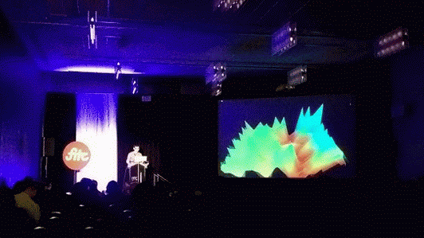

## A talk about Signal Processing



These are the slides for a talk on [signal processing](http://en.wikipedia.org/wiki/Signal_processing) I gave at [FITC Toronto 2014](http://fitc.ca/event/to14/). The talk was filmed by [Jimmy Wang](http://jimicy.com/) and is [on youtube here](https://www.youtube.com/watch?v=Rvsiwi_bmgk) (the above gif is [via Pearl Chen](https://twitter.com/PearlChen/status/460825313912446976)).

This repo is an [openFrameworks](http://openframeworks.cc/) umbrella app, which contains a bunch of smaller apps  (one "app" per slide). The app uses a [WebKit](http://www.webkit.org/) layer in front of the openFrameworks OpenGL layer, allowing each slide's content to be written as a minimal HTML page. The C++ source for each of the apps can be found in `src/`, whereas the html slides are in `bin/data/slides/`.

The not-yet-ready-for-release source for ofxPresent is included here, which is an [openFrameworks addon](http://ofxaddons.com/) I'm still working on. It's an addon which handles the WebKit layer as well as some other utilities (like live page refreshing), that should make it pretty straightforward to use openFrameworks as a base for presentations (or more generally to make use of WebKit text rendering / page layout / etc).

A 32-bit build of [OpenCV 2.4.8](http://opencv.org/) is included (so, this app isn't using the OpenCV build that comes bundled with OF 0.8.1). A build of [LibXTract](https://github.com/jamiebullock/LibXtract) is also included.

### Setup

This app will only work on OSX due to the WebKit layer, ofxAudioUnit and the use of the Accelerate framework. The computer vision slides are fairly cross platform, though, so they should be copy-pasteable if you'd like to experiment with the Convolution slides on Windows, Linux, etc.

- Clone this repo to `openFrameworks/apps/myApps/`
- Add [ofxCv](https://github.com/kylemcdonald/ofxCv) and [ofxAudioUnit](https://github.com/admsyn/ofxAudioUnit) to `openFrameworks/addons/` if you don't have them already
- Open and run the Xcode project included in this repo
- If this doesn't work for you, please open an issue

### Library Licenses

**LibXTract**

```
Copyright (C) 2012 Jamie Bullock

Permission is hereby granted, free of charge, to any person obtaining a copy of this software and associated documentation files (the "Software"), to deal in the Software without restriction, including without limitation the rights to use, copy, modify, merge, publish, distribute, sublicense, and/or sell copies of the Software, and to permit persons to whom the Software is furnished to do so, subject to the following conditions:

The above copyright notice and this permission notice shall be included in all copies or substantial portions of the Software.

THE SOFTWARE IS PROVIDED "AS IS", WITHOUT WARRANTY OF ANY KIND, EXPRESS OR IMPLIED, INCLUDING BUT NOT LIMITED TO THE WARRANTIES OF MERCHANTABILITY, FITNESS FOR A PARTICULAR PURPOSE AND NONINFRINGEMENT. IN NO EVENT SHALL THE AUTHORS OR COPYRIGHT HOLDERS BE LIABLE FOR ANY CLAIM, DAMAGES OR OTHER LIABILITY, WHETHER IN AN ACTION OF CONTRACT, TORT OR OTHERWISE, ARISING FROM, OUT OF OR IN CONNECTION WITH THE SOFTWARE OR THE USE OR OTHER DEALINGS IN THE SOFTWARE.
```

**OpenCV**

```
                          License Agreement
               For Open Source Computer Vision Library

Copyright (C) 2000-2008, Intel Corporation, all rights reserved.
Copyright (C) 2008-2011, Willow Garage Inc., all rights reserved.
Third party copyrights are property of their respective owners.

Redistribution and use in source and binary forms, with or without modification,
are permitted provided that the following conditions are met:

  * Redistributions of source code must retain the above copyright notice,
    this list of conditions and the following disclaimer.

  * Redistributions in binary form must reproduce the above copyright notice,
    this list of conditions and the following disclaimer in the documentation
    and/or other materials provided with the distribution.

  * The name of the copyright holders may not be used to endorse or promote products
    derived from this software without specific prior written permission.

This software is provided by the copyright holders and contributors "as is" and
any express or implied warranties, including, but not limited to, the implied
warranties of merchantability and fitness for a particular purpose are disclaimed.
In no event shall the Intel Corporation or contributors be liable for any direct,
indirect, incidental, special, exemplary, or consequential damages
(including, but not limited to, procurement of substitute goods or services;
loss of use, data, or profits; or business interruption) however caused
and on any theory of liability, whether in contract, strict liability,
or tort (including negligence or otherwise) arising in any way out of
the use of this software, even if advised of the possibility of such damage.
```
